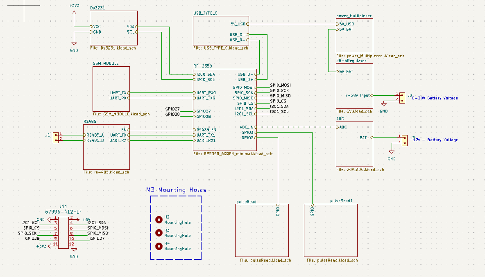
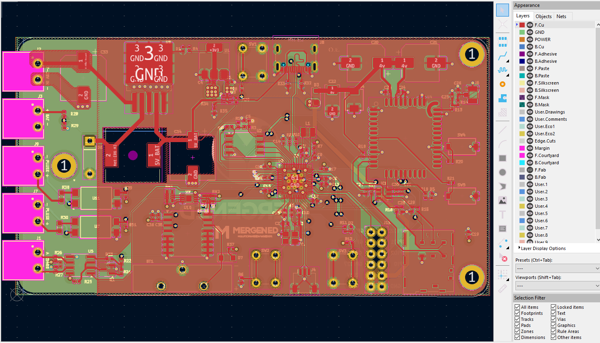
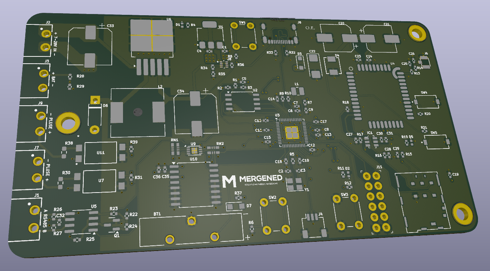
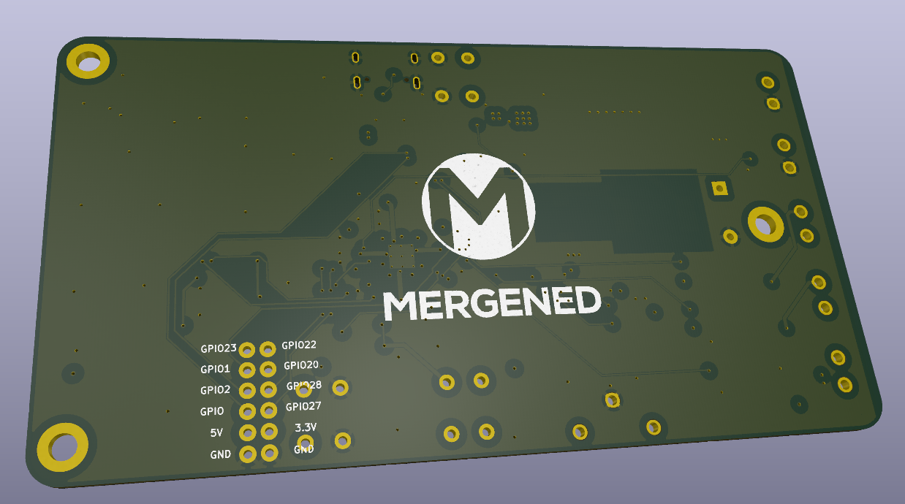
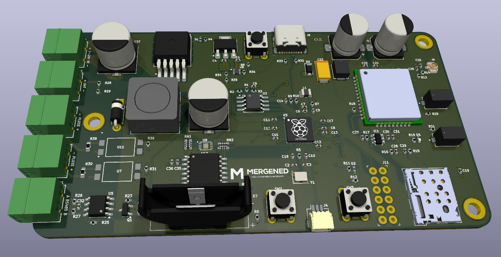

# RP2350 PALS OKUMA VE GONERME KARTI
## KART ÖZELLİKLERİ 
- RP2350 mikrodenetleyici
- MG2608 GSM Modülü
- Ds3231 RTC
- RS485
- 2 adet optoizalatörlü Pals okuma girişi
- Adc okuma girişi
- Type c girişi
- 7-28 to 5v voltaj girişi
- 5v multiplexer 

## PCB TASARIMI
PCB kiCad üzerinden 4 kartlı olacak şekilde tasarlanmıştır. 

